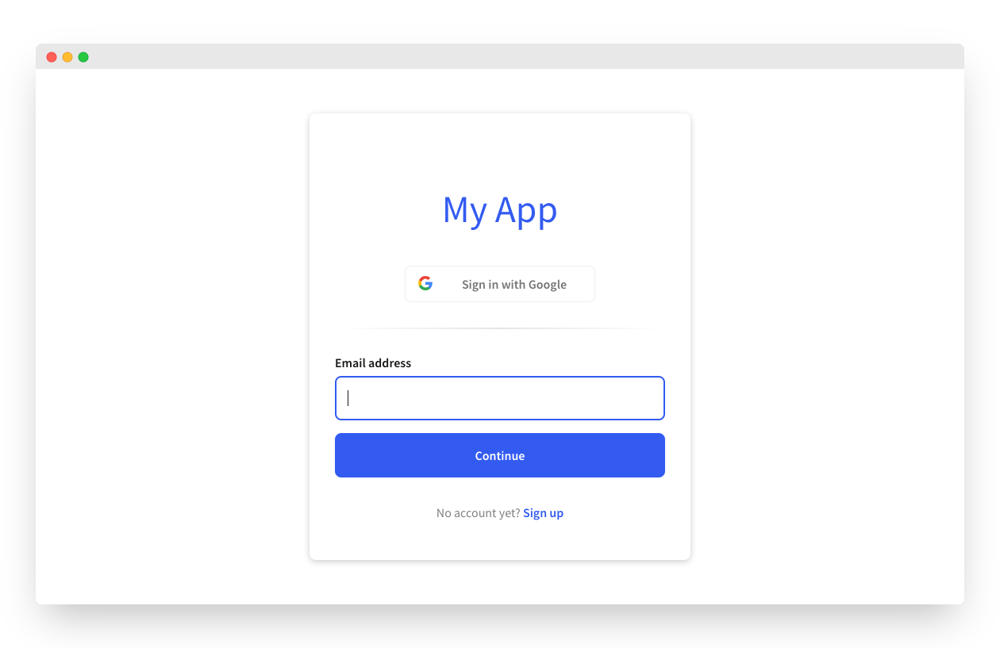
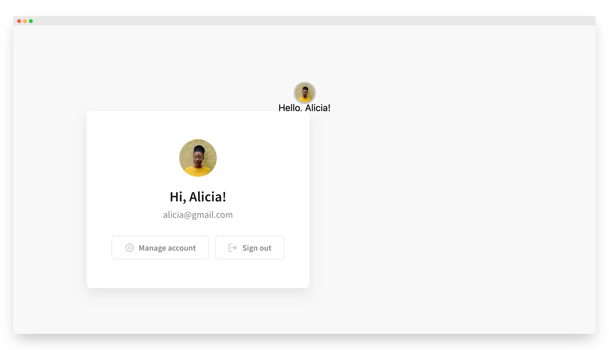

# Get started with Next.js

## Overview

Clerk is the easiest way to add authentication and user management to your [Next.js](https://nextjs.org) application. This guide will walk you through the necessary steps to install and use Clerk in a new Next.js application. For more in-depth guides, check out our **Popular Guides** section.

After following this guide, you should have a working Next.js app complete with:&#x20;

* Fully fledged sign in and sign up flows.
* Google Social Login.
* Secure email/password authentication.
* A prebuilt user profile page.

## Before you start

You need to create a Clerk Application in your [Clerk Dashboard](https://dashboard.clerk.dev). For more information, check out our [Setup your application](../popular-guides/setup-your-application.md) guide.

## Creating a new Next.js app

Start by creating a new Next.js application - this is usually done using the Next.js CLI:



```bash
npx create-next-app
```



```
yarn create next-app
```



If you wish to use TypeScript, just add `--typescript` to the commands above. Clerk is written in TypeScript, so it works out of the box without any extra configuration. For more information, you can reference the [Next.js documentation](https://nextjs.org/docs/api-reference/create-next-app).

## Installing Clerk

Once you have a Next.js app ready, you need to install the [Clerk React SDK](../reference/clerk-react/). This will give you access to our [prebuilt Clerk Components](broken-reference) and React hooks.



```bash
# Navigate to your application's root directory
cd yourapp

# Install the clerk/nextjs package 
npm install @clerk/nextjs
```



```bash
# Navigate to your application's root directory
cd yourapp

# Install the clerk/nextjs package 
yarn add @clerk/nextjs
```



Now, we need to set the `CLERK_FRONTEND_API` environment variable. Go to the [Clerk Dashboard](https://dashboard.clerk.dev), select your **Application**, **** copy the **Frontend API Key** field from the Development instance Home page.


Then, create a file named `.env.local` in your application root. Any variables inside this file with the `NEXT_PUBLIC_` prefix will be accessible in your Next.js code via `process.env.NEXT_PUBLIC_VAR_NAME`. Create a `NEXT_PUBLIC_CLERK_FRONTEND_API` variable and set it to the `Frontend API` you copied earlier:

```bash
# Add environment variable to .env.local file
# Replace [your-frontend-api] with the actual Frontend API key
echo "NEXT_PUBLIC_CLERK_FRONTEND_API=[your-frontend-api]" > .env.local
```

Clerk is now successfully installed   🎉 &#x20;

To run your app, start the development server and navigate to [https://localhost:3000](http://localhost:3000).



```bash
npm run dev
```



```bash
yarn dev
```



For more details, consult the [Clerk React installation](../reference/clerk-react/installation.md) page.

## Adding \<ClerkProvider />

Clerk requires your application to be wrapped in the [`<ClerkProvider/>`](../reference/clerk-react/clerkprovider.md) component. In Next.js, we add this in `pages/_app.js`.&#x20;


```jsx
import { ClerkProvider } from '@clerk/nextjs';

function MyApp({ Component, pageProps }) {

  return (
    // Wrap your entire app with ClerkProvider
    <ClerkProvider>
      <Component {...pageProps} />
    </ClerkProvider>
  );
}

export default MyApp;
```


`<ClerkProvider/>` from the `@clerk/nextjs` package is already configured to using the same routing logic with Next.js.  This makes sure that navigating between subpages and when navigating to callback URLs, routing remains consistent.

Your app is now configured! 🎉  &#x20;

Next, let's see how you can use Clerk to require authentication before navigating to a protected page.

## Requiring authentication

The easiest way to require authentication before showing a protected page, is to use our Control Components:       &#x20;

* [`<SignedIn/>`](../components/signed-in.md): Renders its children only when a user is signed in.
* [`<SignedOut/>`](../components/signed-out.md): Renders its children only when there's no active user.
* [`<RedirectToSignIn/>`](../components/sign-in/redirect-to-sign-in.md): Triggers a redirect to the sign in page.

The following example shows you how to compose our flexible [Control Components](../components/control-components/) to build authentication flows that match your needs. Please note that you don't need to use any additional APIs, everything shown below is just Javascript.


```jsx
import { ClerkProvider, SignedIn, SignedOut, RedirectToSignIn } from '@clerk/nextjs';
import { useRouter } from 'next/router';

//  List pages you want to be publicly accessible, or leave empty if
//  every page requires authentication. Use this naming strategy:
//   "/"              for pages/index.js
//   "/foo"           for pages/foo/index.js
//   "/foo/bar"       for pages/foo/bar.js
//   "/foo/[...bar]"  for pages/foo/[...bar].js
const publicPages = [];

function MyApp({ Component, pageProps }) {
  // Get the pathname
  const { pathname } = useRouter();

  // Check if the current route matches a public page
  const isPublicPage = publicPages.includes(pathname);

  // If the current route is listed as public, render it directly
  // Otherwise, use Clerk to require authentication
  return (
    <ClerkProvider>
      {isPublicPage ? (
        <Component {...pageProps} />
      ) : (
        <>
          <SignedIn>
            <Component {...pageProps} />
          </SignedIn>
          <SignedOut>
            <RedirectToSignIn />
          </SignedOut>
        </>
      )}
    </ClerkProvider>
  );
}

export default MyApp;
```


Visit [https://localhost:3000](https://localhost:3000) to see your page. The home `"/"` page is not listed in the `publicPages` array, so you'll immediately get redirected to the Clerk Hosted Sign In page:



## Hello, world!

That's all you need to start using Clerk. Now you can say hello to your user!&#x20;

Edit the `pages/index.js` page. We're going to use the `useUser` hook and the `UserButton` component as shown in the example:


```jsx
import styles from '../styles/Home.module.css';
import { useUser, UserButton } from '@clerk/nextjs';

export default function Home() {
  // Get the current user's firstName
  const { firstName } = useUser();

  return (
    <div className={styles.container}>
      <header>
        {/* Mount the UserButton component */}
        <UserButton />
      </header>
      <main>Hello, {firstName}!</main>
    </div>
  );
}
```


Visit [https://localhost:3000](https://localhost:3000) again to see your page. If you haven't signed in yet, you will be redirected to the sign in page. Sign in using your preferred method and the home page will become accessible:



And that's all!


By default, your app will use the [Clerk Hosted Pages](broken-reference) to display the sign in and sign up flows. Check the documentation of the [\<SignIn/>](../components/sign-in/sign-in.md) and [\<SignUp/>](../components/sign-up/sign-up.md) components to learn how you can mount them directly in your app.


## Next steps

You now have a working Next.js + Clerk app.  Going forward, you can:

* Check out the [`clerk-nextjs-starter`](https://github.com/clerkinc/clerk-nextjs-starter)template
* Learn more about the [Clerk Components](broken-reference) and the [Clerk Hosted Pages](broken-reference).
* Read our in-depth guides on the most common use cases in the **Popular Guides** section.
* When you're ready, learn how to [deploy your app to production](../popular-guides/production-setup.md).
* Get support or at least say hi in our [Discord channel](https://discord.com/invite/b5rXHjAg7A) 👋
