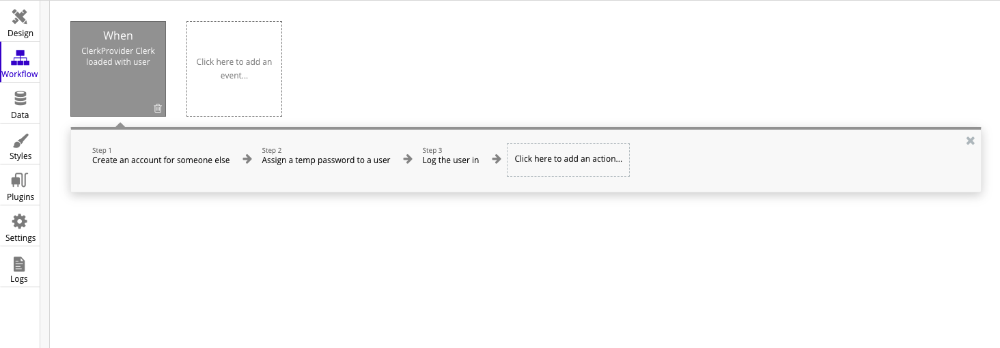
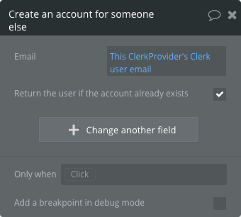
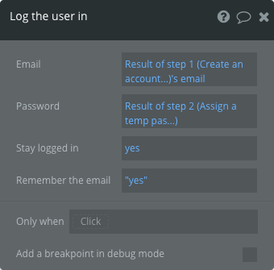
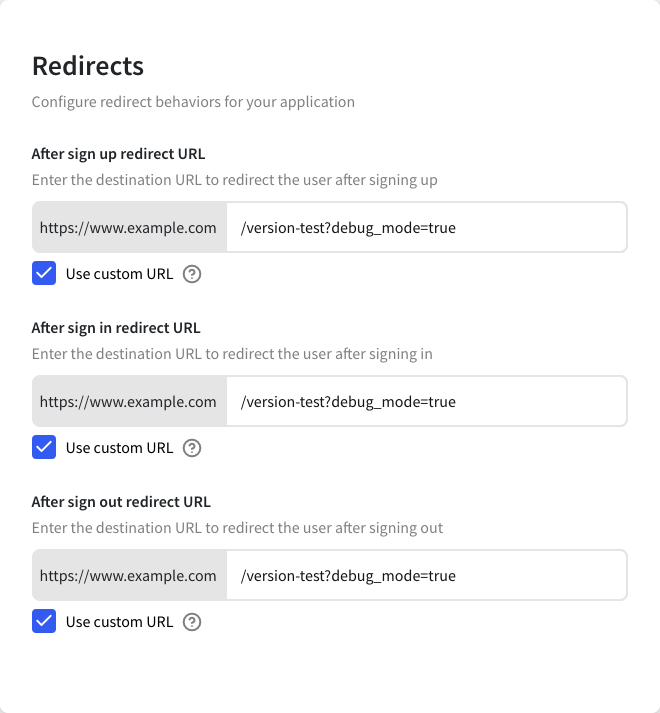
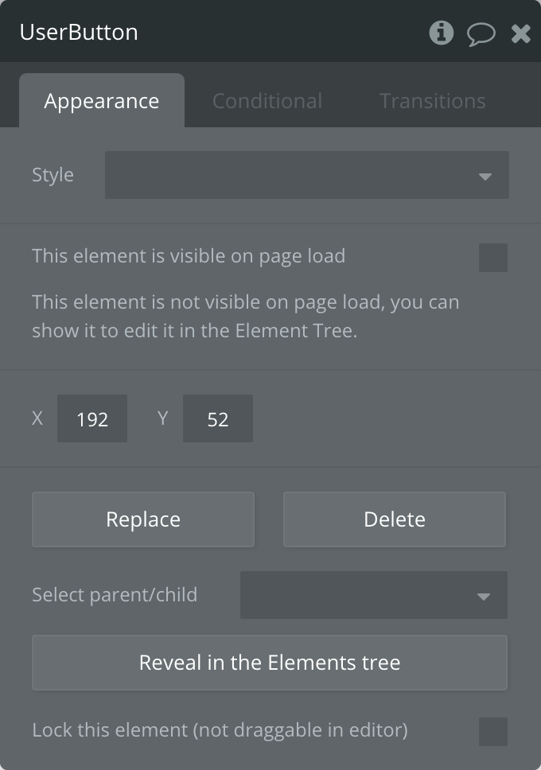

# bubble.io \(beta\)

This integration allows you to use Clerk as the authentication and user management solution for your [bubble.io](https://bubble.io) sites. Add social logins, passwordless auth, multi-factor auth, the familiar user profile button, and more all without code.


**The bubble.io plugin is currently in closed beta.** To get access to the official Clerk plugin, reach out to us on any of our [support channels](https://clerk.dev/support) so we can add you to the beta.


## 1. Install the official bubble.io Clerk plugin

To get access to the official Clerk plugin, reach out to us on any of our [support channels](https://clerk.dev/support) so we can add you to the beta.

### 1.1 Add the FRONTEND\_API key

After you install the Clerk plugin, add the `FRONTEND_API` key for your instance. 

_You can find this value on your instance's **Home** page. For more information, go to our_ [_**Frontend API**_](../reference/frontend-api-reference/) _****_documentation.

## 2. Automatic sign-up/log-in workflow

For Clerk to work with bubble's sign-up/log-in mechanism, you need to add the Clerk workflow. All actions come from the base bubble _Account_ type. The final result of workflow will look like this: 

The workflow must be triggered from ClerkProvider's _"Clerk loaded with user"_ event.

### The ClerkProvider element

In order to use Clerk on your page, first you need to add the **ClerkProvider** element.  It can go anywhere, and does not display anything.

To create the workflow follow these steps:

### Step 1 - Create an account for someone else

### Step 2 - Assign a temp password to a user

### Step 3 - Log the user in

That's it! Now bubble will recognize your users, and you can use Clerk elements and actions throughout your page.

## 3. Sign out workflow

For sign out to work, you will need to sign out of both Clerk and bubble.  An example sign out workflow is as follows:

When the _Signout_ button is clicked, the action "_Account_ **→**_Log the user out"_  is triggered along with the "_Clerk **→** Signout"_ action.

## 4. \(Preview-only\) URL Redirects

In bubble's preview environment, your app will be running on the following URL: `/version-test?debug_mode=true`. In order to make Clerk work during preview mode, you need to redirect here after adjust your **Redirects** in the Clerk dashboard to point to this value. 

Under **Settings → URL & redirects → Redirects** select "Use custom URL" and enter `/version-test?debug_mode=true` for the following fields:

* After sign up redirect URL
* After sign in redirect URL
* After sign out redirect URL

The final result should look like this:

## Actions

The Clerk plugin includes basic actions that allow you to link sign-up, log-in and sign-out processes to your page elements.

#### OpenSignup

The _OpenSignup_ action will open the Clerk sign-up modal.

#### OpenSignin

The _OpenSignin_ action will open the Clerk sign-in modal.

#### Signout

The _Signout_ action will sign out the active user.

## Elements

The Clerk plugin includes pre-built elements that can enhance your application's user experience.

### ClerkProvider

The _ClerkProvider_ element is the base building block for the integration between your page and Clerk. For actions and workflows to function properly, you need to add a ClerkProvider element anywhere on your page so that actions can reference it.

This element does not display anything.

### UserButton

The _UserButton_ element gives your users an easy way to manage their account\(s\).


_The element should not be visible on page load, as shown below._


To show the _UserButton_, add a new workflow using a_"Clerk loaded with user"_ event. This workflow will show the _UserButton_ once Clerk has fully loaded. Here's what this workflow will look like:

## Frequently Asked Questions

* **Where can I manage my application's users?** Users can be managed from the [Clerk Dashboard](https://dashboard.clerk.dev) in the **Users** section. 
* **Can I change the Clerk interface theme to match my application ?** Yes! Navigate to **Settings → Theme** in the [Clerk Dashboard](https://dashboard.clerk.dev) for your instance for complete customizability.  _Don't forget to press the Apply changes button!_
* **Can I migrate all my existing bubble.io users to Clerk ?** Yes! [Contact us](https://clerk.dev/support) and we can help you migrate your existing user base.

If you have any questions, feature requests, or bug reports, feel free to [contact us](https://clerk.dev/support) at any time!

