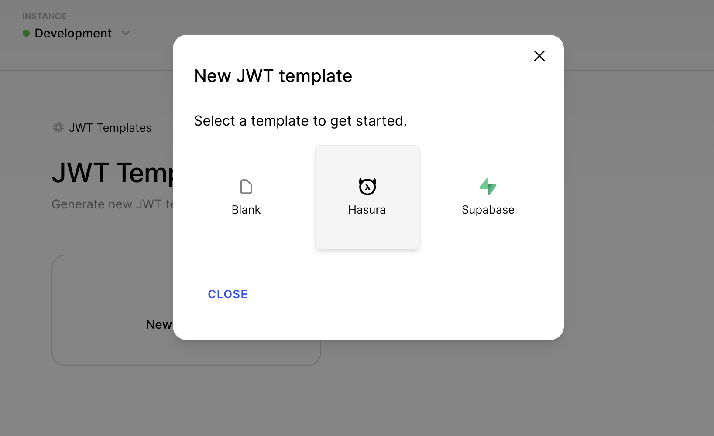
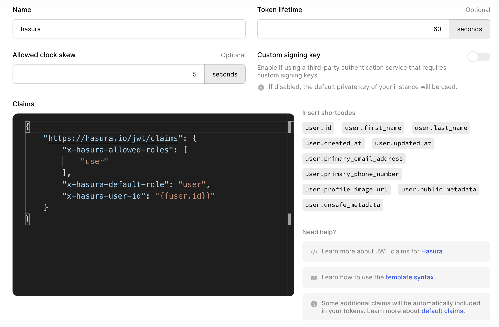
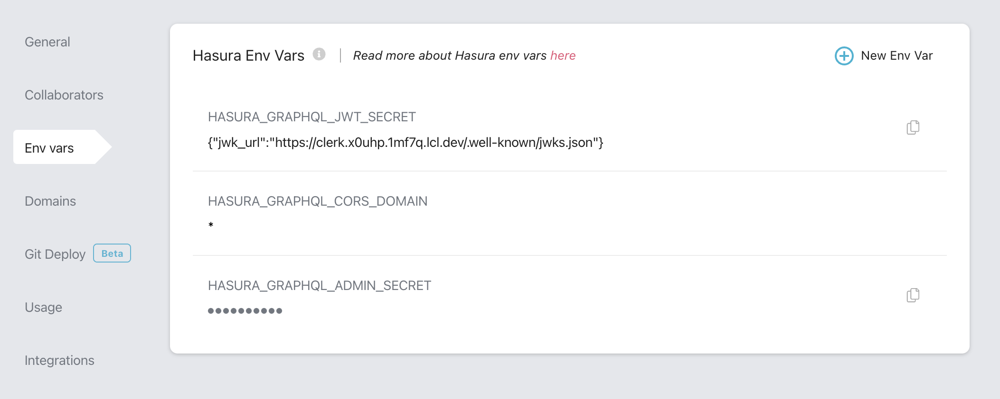

# Hasura

The Clerk integration with Hasura enables you to authenticate requests to Hasura using a JSON Web Token (JWT) created with our [JWT Templates](https://docs.clerk.dev/popular-guides/jwt-templates) feature.

We have an official starter repo with Next.js and Hasura, check it out [here](https://github.com/clerkinc/clerk-hasura-starter).

### Getting started

You can connect your Clerk-authenticated application to a Hasura GraphQL endpoint within minutes.

The first step is to navigate to **JWT Templates** from the Clerk Dashboard.

Click on the button to create a New Template based on Hasura.



This will pre-populate the default claims required by Hasura. You can include additional claims or modify them as necessary. [Shortcodes](https://docs.clerk.dev/popular-guides/jwt-templates#shortcodes) are also available to make adding dynamic user values easy.



By default, Clerk will sign the JWT with a private key automatically generated for your application, which is what most developers use for Hasura. If you so choose, you can customize this key.

### Configure Hasura

The next step is to provide Hasura with the public keys used to verify the JWT issued by Clerk. Assuming you didn’t use a [custom key](hasura.md#with-custom-signing-key), this can be done by using a JSON Web Key Set (JWKS), which Clerk automatically creates an endpoint for with your Frontend API (`https://<YOUR_FRONTEND_API>/.well-known/jwks.json`).

You can set up your project either with Hasura Cloud or you can [run the Hasura GraphQL engine locally using Docker Compose](https://hasura.io/docs/latest/graphql/core/getting-started/docker-simple.html#docker-simple).

#### Set up with Hasura Cloud

Go to your project settings, click “Env vars” and then add “New Env Var.”

Set the key to `HASURA_GRAPHQL_JWT_SECRET` and value to the following:

```json
{"jwk_url":"https://<YOUR_FRONTEND_API>/.well-known/jwks.json"}
```

Replace `<YOUR_FRONTEND_API>` with the Frontend API value from your Clerk instance dashboard.



#### Set up with Hasura Core

To add the JWT secret locally with Hasura Core, you need to set both the `HASURA_GRAPHQL_ADMIN_SECRET` and `HASURA_GRAPHQL_JWT_SECRET` in the `docker-compose.yml` file.

`HASURA_GRAPHQL_ADMIN_SECRET` can be set to any text string.

`HASURA_GRAPHQL_JWT_SECRET` should be set to a stringified JSON object of the JWT secret which contains the JWKS endpoint as the value of `jwk_url`.

```yaml
HASURA_GRAPHQL_ADMIN_SECRET: myadminsecretkey
HASURA_GRAPHQL_JWT_SECRET: '{"jwk_url":"https://<YOUR_FRONTEND_API>/.well-known/jwks.json"}'.
```

Replace `<YOUR_FRONTEND_API>` with the Frontend API value from your Clerk instance dashboard.

#### With Custom Signing Key

If you did use a custom signing key, instead of providing the `jwk_url` you need to provide the algorithm `type` and `key` in the stringified JSON object as the `HASURA_GRAPHQL_JWT_SECRET` in the Hasura Cloud Env Vars or in the `docker-compose.yml` file.

```yaml
HASURA_GRAPHQL_JWT_SECRET: '{"type": "HS256", "key": "<YOUR_SIGNING_KEY>" }'
```

### **Configure your GraphQL client**

GraphQL clients (such as [Apollo Client](https://github.com/apollographql/apollo-client) and [Relay](https://github.com/facebook/relay)) can help with querying and caching your data. They can also manage UI state, keep data in sync, and boost performance. That said, you can make a GraphQL request to the Hasura backend with the native browser [Fetch API](https://developer.mozilla.org/en-US/docs/Web/API/Fetch\_API).

The last step of integrating Clerk as the modern web authentication solution for Hasura is to pass the JWT in the `Authorization` header with your requests. You can access the token generated with the Hasura claims by calling `getToken({ template: <your-template-name> })` on the Session object with the name of your template.

Even if you don’t have a database table set up yet, we can make use of the [built-in GraphQL introspection system](https://graphql.org/learn/introspection/) to validate that the authenticated requests are working properly.

Here is an example of using Fetch in conjunction with the `useSWR` hook in a Next.js application to make a request to the Hasura GraphQL endpoint:

```jsx
import { useSession } from '@clerk/nextjs';
import useSWR from 'swr';

// This component needs to be a child of <ClerkProvider> and <SignedIn>
// in order to access the authenticated session object
const Main = () => {
  const { getToken } = useSession();
  const endpoint = process.env.NEXT_PUBLIC_HASURA_GRAPHQL_API;
  const query = `query { __schema { types { name } } }`;
  const fetcher = async (...args) =>
    fetch(...args, {
      method: 'POST',
      headers: {
        'Content-Type': 'application/json',
        Accept: 'application/json',
        Authorization: `Bearer ${await getToken({ template: 'hasura' })}`
      },
      body: JSON.stringify({ query })
    }).then(res => res.json());

  const { data } = useSWR(endpoint, fetcher);

  return <p>GraphQL schema has {data?.data?.__schema.types.length} types</p>;
};

export default Main;
```

Note that the `getToken({ template: <your-template-name> })` call is asynchronous and returns a Promise needs to be resolved before accessing the token value. This token is short-lived for better security and should be called before every request to your GraphQL API. The caching and refreshing of the token is handled automatically by Clerk.

### Next steps

* Check out our official [Clerk and Hasura with Next.js starter repo](https://github.com/clerkinc/clerk-hasura-starter)
* Replace `fetch` with a GraphQL client like [Apollo](https://github.com/apollographql/apollo-client) or [graphql-request](https://github.com/prisma-labs/graphql-request)
* Try adding some [custom claims](https://docs.clerk.dev/popular-guides/jwt-templates#template-basics) to the JWT token
* Get support or at least say hi in our [Discord channel](https://discord.com/invite/b5rXHjAg7A) 👋
