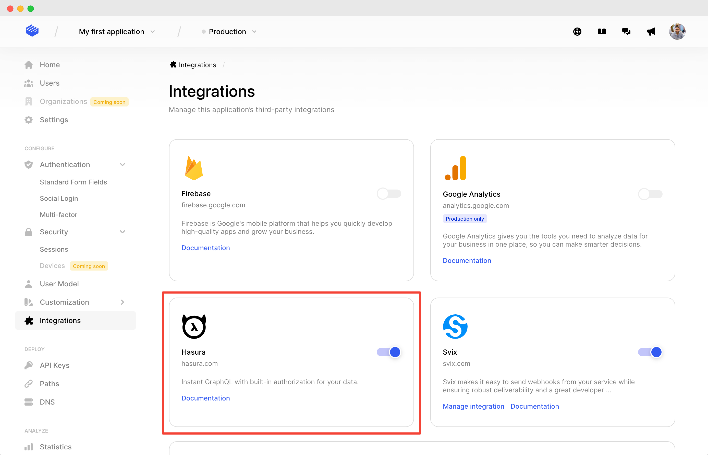

# Hasura

The Clerk integration with Hasura enables you to authenticate requests to Hasura [using a JWT](https://hasura.io/docs/latest/graphql/core/auth/authentication/jwt.html).

We have an official starting repo with Next.js and Hasura, check it out [here](https://github.com/clerkinc/clerk-hasura-starter).

## 1. Turn on the integration

To get started, first turn on the Hasura integration in the [dashboard](https://dashboard.clerk.dev):

**Your Application and instance → Integrations → Hasura**



## 2. Configure Hasura

**2.1. With Hasura Core**

Following [the documentation here](https://hasura.io/docs/latest/graphql/core/auth/authentication/jwt.html#running-with-jwt), start Hasura with the following "JWT secret." Replace **%FRONTEND\_API%** with the Frontend API value on the Home page of your Instance dashboard:

```javascript
{"jwk_url":"https://%FRONTEND_API%/.well-known/jwks.json"}
```

**2.2. With Hasura Cloud**

If you are using Hasura Cloud, go to your project settings. Click "Env vars" on the sidebar and add "New Env Var".

Set the key to `HASURA_GRAPHQL_JWT_SECRET` and the value to the following. Replace **%FRONTEND\_API%** with the Frontend API value on the Home page of your Instance dashboard:

```javascript
{"jwk_url":"https://%FRONTEND_API%/.well-known/jwks.json"}
```

## 3. **Configure your GraphQL client**

Hasura uses the `Authorization` header to authenticate requests. You can retrieve the necessary header from Clerk by calling `getToken("hasura")` on the User object.

`getToken` should be called before every request to your GraphQL API.  Each token is short-lived for better security, and `getToken` automatically handles caching and refreshing.

### **3.1.** [**Apollo**](https://www.apollographql.com)

First, you need to install two dependencies:

```http
npm install @apollo/client graphql
# or
yarn add @apollo/client graphql
```

Now, let's create a new file for our Apollo client:



```javascript
// lib/apolloClient.js

import {
  ApolloProvider,
  ApolloClient,
  HttpLink,
  from,
  InMemoryCache,
} from "@apollo/client";
import { setContext } from "@apollo/client/link/context";
import { useUser } from "@clerk/clerk-react";

const hasuraGraphqlApi = "YOUR_HASURA_GRAPHQL_API";

export const ApolloProviderWrapper = ({ children }) => {
  const user = useUser();
  const authMiddleware = setContext(async (req, { headers }) => {
    const token = await user.getToken("hasura");
    return {
      headers: {
        ...headers,
        authorization: `Bearer ${token}`,
      },
    };
  });

  const httpLink = new HttpLink({
    uri: hasuraGraphqlApi,
  });

  const apolloClient = new ApolloClient({
    link: from([authMiddleware, httpLink]),
    cache: new InMemoryCache(),
  });

  return <ApolloProvider client={apolloClient}>{children}</ApolloProvider>;
};
```



To get your  `HASURA_GRAPHQL_API`  in Hasura Cloud, you can get it in the [projects page](https://cloud.hasura.io/projects), click the cog wheel, and you'll find it under "GraphQL API".

Then, the last step would be wrapping the components you want to give access to Apollo and the GraphQL API with the `ApolloProviderWrapper`. Remember that there has to be a `<SignedIn>` component wrapping the `ApolloProviderWrapper`. You can read more about it [here](../components/signed-in.md).

