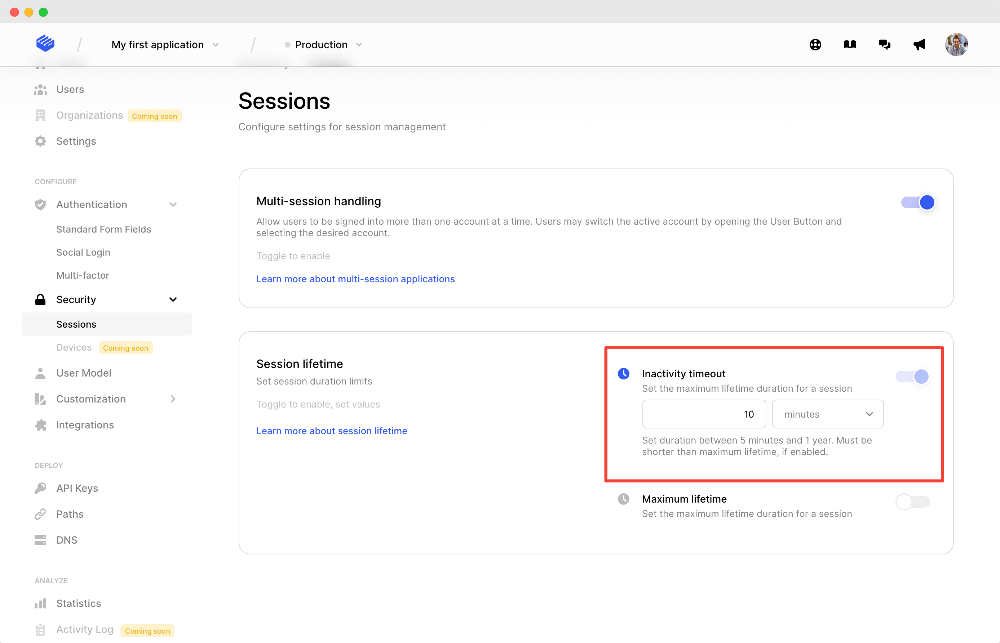
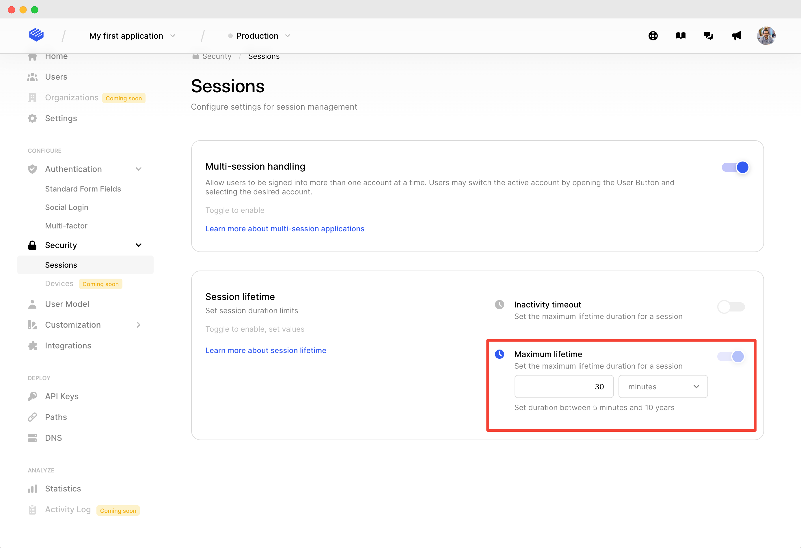

# Session Lifetime

## Overview

Depending on the business domain of an application, there might different requirements for how long users should remain signed in. Criteria to base this decision upon, typically revolve around user activity on the application and how long it has been since the user first signed in.

Ultimately, picking the ideal session lifetime is a trade-off between security and user experience. Longer sessions are generally better for UX but worse for security; and vice-versa.

Fortunately, with Clerk you have to ability to fully control the lifetime of your users' sessions. There are two settings for doing so and you can set them via your instance settings in the Dashboard: **Inactivity timeout** and **Maximum lifetime**.&#x20;


Note that anytime either of them or both must be enabled. You are not allowed to disable both of them with respect to security.


## Inactivity Timeout

Denotes the duration after which a session will expire and the user will have to sign in again, if they haven't been active on your site. **By default this setting is disabled** for all newly created instances. You can enable it and set your desired value in **Security -> Sessions** section.

## Maximum lifetime

Denotes the duration after which a session will expire and the user will have to sign in again, regardless of their activity on your site. **By default this setting is enabled with a default value of 7 days** for all newly created instances. You can find this setting and change the value in **Security -> Sessions**.

