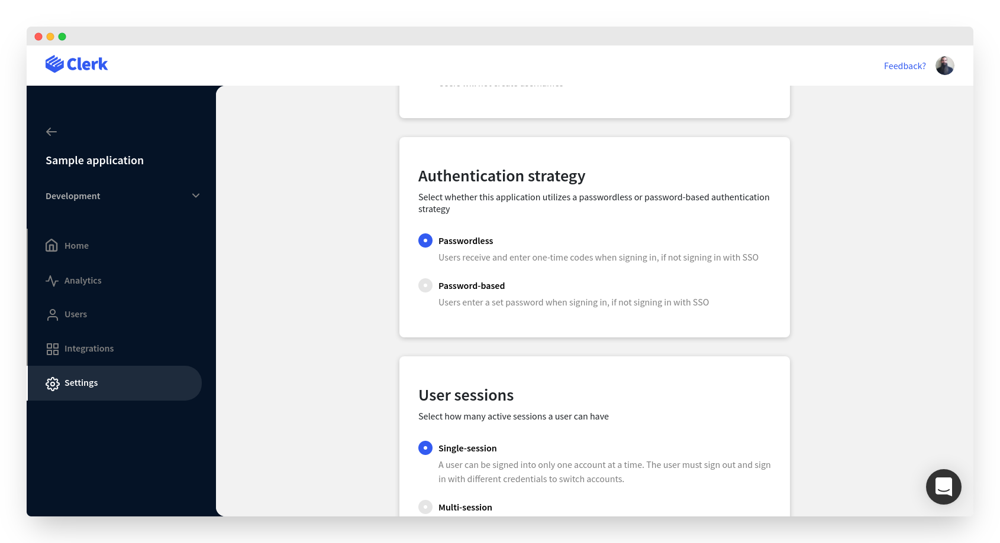
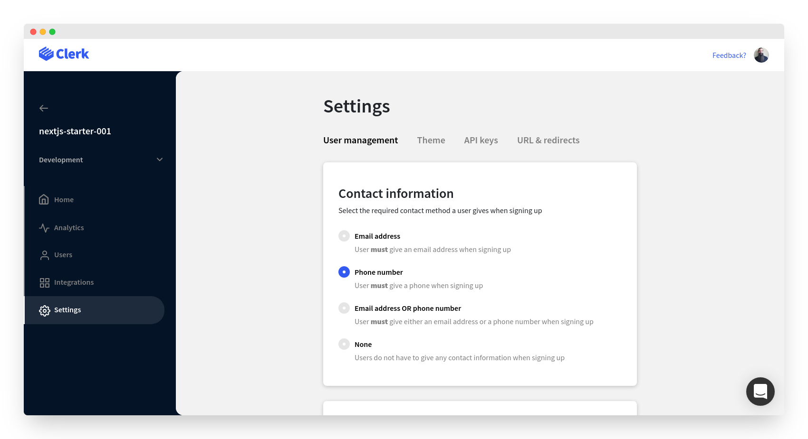
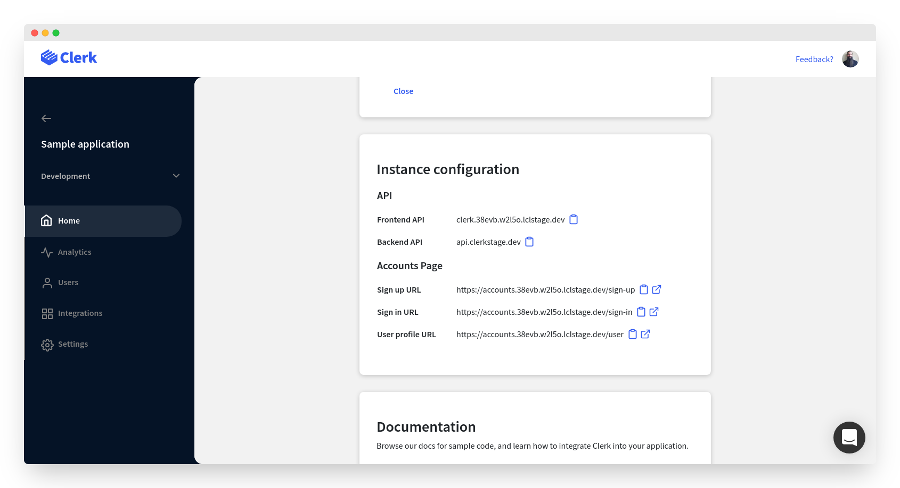

# One-time code authentication

## Overview

Clerk supports passwordless authentication, which lets users sign in and sign up without having to remember a password. During sign in, users will be asked to enter their identifier (email address or phone number) to receive a one-time code and complete the authentication process.\
\
Arguably, passwordless authentication provides greater security and a better user experience than traditional passwords.  However, it is not without its downsides, and often still boils down to the email providers "knowledge based factor" instead of yours.

There are a few different ways to set up passwordless authentication in Clerk; [Clerk Hosted Pages](passwordless-authentication.md#using-clerk-hosted-pages), [Clerk Components](passwordless-authentication.md#using-clerk-components) and by creating a [custom flow](passwordless-authentication.md#custom-flow) using Clerk's SDKs.

The rest of this guide will explain how to set up passwordless authentication using any of the above methods. Before you start, you will need to [configure your instance](passwordless-authentication.md#configuration) to allow passwordless sign-ins.


Looking for magic links? Check out our [Magic links authentication](magic-links.md) guide.



Looking for 2FA? Check out our [Multi-factor authentication](multi-factor-authentication.md) guide.


## Before you start

* You need to create a Clerk Application in your [Clerk Dashboard](https://dashboard.clerk.dev). For more information, check out our [Setup your application](setup-your-application.md) guide.
* You need to install [Clerk React](../reference/clerk-react/) or [ClerkJS](../reference/clerkjs/) to your application.

## Configuration

Passwordless authentication can be configured through the [Clerk Dashboard](https://dashboard.clerk.dev). Go to your instance, then **Settings** >  **User management** > **Authentication strategy.** Simply choose **Passwordless** as the authentication strategy.



Don't forget that you also need to make sure you've configured your application instance to request the user's contact information.  Users can receive one-time codes via either an email address or a phone number.

Go to your instance **Settings** page again, select **User management** > **Contact Information**. Make sure you select one of the following options;  **Email address**, **Phone number** or **Email address OR phone number**.&#x20;

For the rest of this guide, we'll use the **Phone number** option.




Don't forget to click on the **Apply Changes** button at the bottom of the page once you're done configuring your instance.


That's all you need to do to enable passwordless authentication for your instance. Now let's see how we can put this configuration to good use.

## Using Clerk Hosted Pages

If you're looking for the fastest way to implement passwordless based authentication, you can leverage [Clerk Hosted Pages](../main-concepts/clerk-hosted-pages.md) for your sign up, sign in, and user profile pages. You can set these up on your own domain, and match your websites theme with the Clerk Dashboard to create a seamless experience.&#x20;

You can find your instances sign up and sign in links in the **Home** > **Instance configuration** section of your instance in Clerk Dashboard.&#x20;



By default, the URLs for your hosted pages will match the following pattern:

```http
https://accounts.[your-domain].com/sign-in
https://accounts.[your-domain].com/sign-up
https://accounts.[your-domain].com/user
```


For development instances, Clerk will issue you a domain on "lcl.dev".  In production, you'll need to supply your own domain. See [Production setup](production-setup.md) or more information


Clerk provides SDKs to make navigating to these pages easy. &#x20;



```jsx
import { 
  RedirectToSignUp,
  RedirectToSignIn
} from "@clerk/clerk-react";

// Rendering the RedirectToSignOut component will 
// cause the browser to navigate to the Sign up 
// URL and show the Sign Up Clerk Hosted Page.
function App() {
  return <RedirectToSignUp />;
}

// Rendering the RedirectToSignIn component will 
// cause the browser to navigate to the Sign in 
// URL and show the Sign In Clerk Hosted Page.
function App() {
  return <RedirectToSignIn />;
}
```



```javascript
// redirectToSignIn will cause the browser to
// visit the Clerk Hosted Pages Sign in URL.        
window.Clerk.redirectToSignIn();

// redirectToSignIn will cause the browser to
// visit the Clerk Hosted Pages Sign in URL.
window.Clerk.redirectToSignIn();
```




Read our detailed [Clerk Hosted Pages guide](../main-concepts/clerk-hosted-pages.md) to learn more.


## Using Clerk Components

You can leverage [Clerk Components](../main-concepts/clerk-components.md) in order to easily add support for passwordless authentication in your application.

Clerk provides a [\<SignUp />](../components/sign-up.md) pre-built component that renders a sign up form to handle user registrations.

Similarly, there's a [\<SignIn />](../components/sign-in.md) pre-built component that renders a sign in form and takes care of user authentication and session creation.

Note that you don't need to pass any special options to the pre-built **\<SignUp />** and **\<SignIn />** components. Passwordless authentication will just work, since you already configured through the Clerk [dashboard](https://dashboard.clerk.dev).

### Sign up <a href="#clerk-components-sign-up" id="clerk-components-sign-up"></a>

Signing users up to your application is as simple as rendering the **\<SignUp />** component.



```jsx
import { SignUp } from "@clerk.clerk-react";

// SignUpPage is your custom sign up page component.
function SignUpPage() {
  return (
    // The Clerk SignUp component needs no special 
    // configuration. Passwordless authentication
    // will just work when configured from the 
    // Clerk dashboard.
    <SignUp />
  );
}
```



```markup
<html>
<body>
    <div id="sign-up"></div>
    
    <script>
        const signUpEl = document.getElementById("sign-up");
        // Mount the pre-built Clerk SignUp component
        // in an HTMLElement on your page. 
        window.Clerk.mountSignUp(signUpEl);
        
        // Render the SignUp component as a  
        // modal on the page.
        window.Clerk.openSignUp();
    </script>
</body>
```



### Sign in <a href="#clerk-components-sign-in" id="clerk-components-sign-in"></a>

Signing users in with a one-time token is as simple as mounting the **\<SignIn />** component.



```jsx
import { SignIn } from "@clerk/clerk-react";

// SignInPage is your custom sign in page component.
function SignInPage() {
  return (
    // The Clerk SignIn component needs no special
    // configuration. 
    <SignIn />
  );
}
```



```markup
<html>
<body>
    <div id="sign-in"></div>
    
    <script>
        const signInEl = document.getElementById("sign-in");
        // Mount the pre-built Clerk SignIn component
        // in an HTMLElement on your page. 
        window.Clerk.mountSignIn(signInEl);
        
        // Render the SignIn component as a 
        // modal on the page.
        window.Clerk.openSignIn();
    </script>
</body>
```




If you're interested in more pre-built offerings, you can read more about [Clerk Components](../main-concepts/clerk-components.md).


## Custom flow

In case one of the above integration methods doesn't cover your needs, you can make use of lower level commands and create a completely custom passwordless authentication flow.

You still need to configure your instance in order to enable passwordless authentication, as described at the [top of this guide](passwordless-authentication.md#configuration).

### Sign up <a href="#custom-flow-sign-up" id="custom-flow-sign-up"></a>

The passwordless sign up flow is a process which requires users to provide their authentication identifier (email address or phone number) and a one-time code that is sent to them. The important thing to note here is that a user's email address or phone number needs to be verified before the registration is completed.

A successful sign up consists of the following steps:

1. Initiate the sign up process, by collecting the user's identifier (email address or phone number).
2. Prepare the identifier verification.
3. Attempt to complete the identifier verification.

Let's see the above in action. If you want to learn more about sign-ups, check out our documentation on Clerk's [Sign up flow](../main-concepts/sign-up-flow.md).



```jsx
import { useSignUp } from "@clerk/clerk-react";

function SignUpPage() {
    const signUp = useSignUp();
    
    async function onClick(e) {
        e.preventDefault();
        // Kick off the sign-up process, passing the user's
        // phone number.
        await signUp.create({
            phoneNumber: "+11111111111",
        });
        
        // Prepare phone number verification. An SMS message 
        // will be sent to the user with a one-time 
        // verification code.
        await signUp.preparePhoneNumberVerification();
        
        // Attempt to verify the user's phone number by 
        // providing the one-time code they received.
        await signUp.attemptEmailAddressVerification({
            code: "123456",
        });    
    }
    
    return (
        <button onClick={onClick}>
            Sign up without password
        </button>
    );
}
```



```javascript
const { client } = window.Clerk;

// Kick off the sign-up process, passing the user's
// phone number.
const signUp = await client.signUp.create({
    phoneNumber: "+11111111111",
});

// Prepare phone number verification. An SMS will 
// be sent to the user with a one-time verification 
// code.
await signUp.preparePhoneNumberVerification();

// Attempt to verify the user's phone number by providing
// the one-time code they received.
await signUp.attemptPhoneNumberVerification({
    code: "123456",
});
```



You can also verify your users via their email address. There's two additional helper methods, `prepareEmailAddressVerification` and `attemptEmailAddressVerification` that work the same way as their phone number counterparts do. You can find more available methods in our ClerkJS API documentation for the [SignUp object](../reference/clerkjs/signup.md).

### Sign in <a href="#custom-flow-sign-in" id="custom-flow-sign-in"></a>

The passwordless sign in flow is a process which requires users to provide their authentication identifier (email address or phone number) and subsequently a one-time code that is sent to them. We call this one-time code the first factor of authentication.

So, in essence, when you want to authenticate users in your application, you  need to

1. Initiate the sign in process, by collecting the user's authentication identifier.
2. Prepare the first factor verification.
3. Attempt to complete the first factor verification.

Let's see the above in action. If you want to learn more about sign ins, check out our documentation on Clerk's [Sign in flow](../main-concepts/sign-in-flow.md).



```jsx
import { useSignIn } from "@clerk/clerk-react";

function SignInPage() {
    const signIn = useSignIn();
    
    async function onClick(e) {
        e.preventDefault();
        // Kick off the sign-in process, passing the user's 
        // authentication identifier. In this case it's their
        // phone number.
        await signIn.create({ 
            identifier: "+11111111111",
        });

        // Prepare first factor verification, specifying 
        // the phone code strategy.
        await signIn.prepareFirstFactor({ 
            strategy: "phone_code", 
            phone_number_id: "idn_1vf1vozUmkg2iN6WY0efWDcEC1a",
        });

        // Attempt to verify the user providing the
        // one-time code they received.
        await signIn.attemptFirstFactor({
            strategy: "phone_code",
            code: "123456",
        });
    }
    
    return (
        <button onClick={onClick}>
            Sign in without password
        </button>
    );
}
```



```javascript
const { client } = window.Clerk;
// Kick off the sign-in process, passing the user's 
// authentication identifier. In this case it's their
// phone number.
const signIn = await client.signIn.create({ 
    identifier: "+11111111111",
});

// Prepare first factor verification, specifying 
// the phone code strategy.
await signIn.prepareFirstFactor({ 
    strategy: "phone_code", 
    phone_number_id: "idn_1vf1vozUmkg2iN6WY0efWDcEC1a",
});

// Attempt to verify the user providing the
// one-time code they received.
await signIn.attemptFirstFactor({
    strategy: "phone_code",
    code: "123456",
});
```



You can also achieve passwordless sign-ins with email address. Simply pass the value **email\_code** as the first factor strategy. Just make sure you've collected the user's email address first. You can find all available methods on the [SignIn object](../reference/clerkjs/signin.md) documentation.
