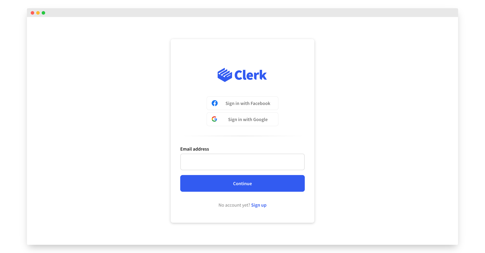
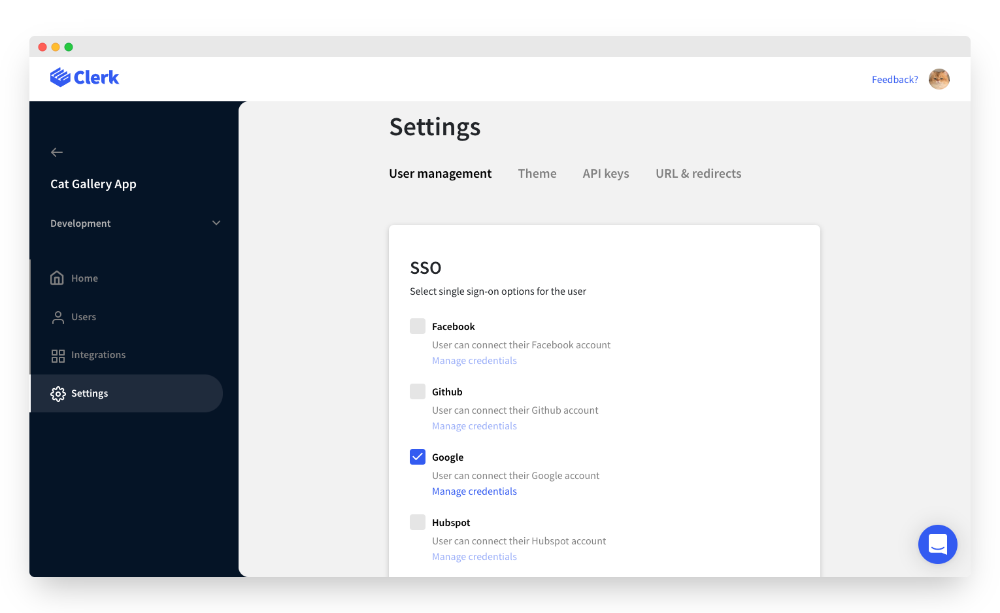
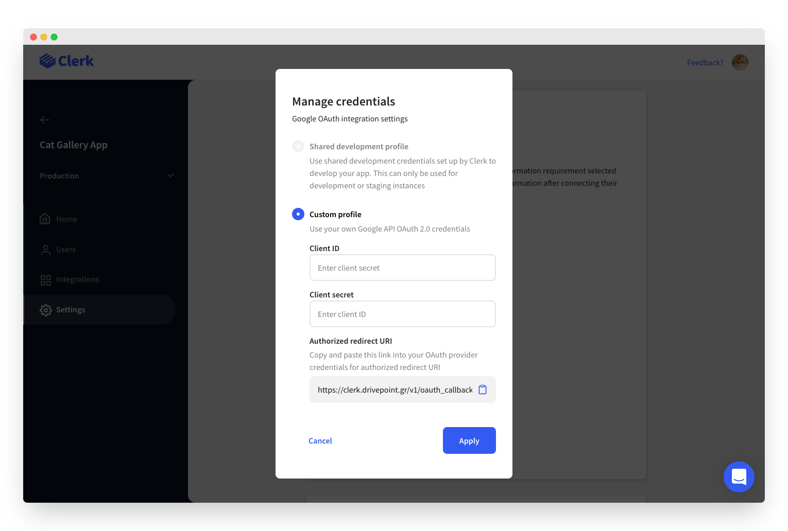
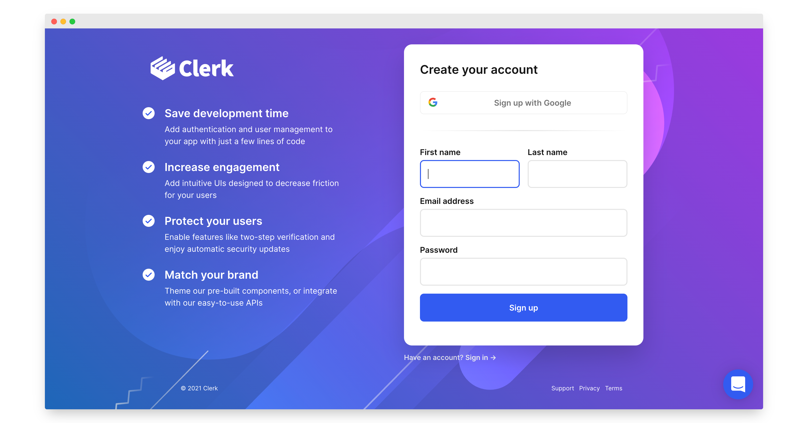

# Social login \(OAuth\)

## Overview

Clerk makes it easy to add social login capabilities to your application. Social login is designed to simplify the sign up and sign in processes for the end user, resulting in higher conversion rates, a streamlined user data collection flow and an overall better user experience. 



Social login provides better security than passwords and other long-lived knowledge-based secrets.  With social login, users gain frictionless access to your application by using their existing credentials from an OAuth provider \(Google, Facebook, Twitter etc\) without having to go through complicated registration flows.


When using social login, the sign up and sign in flows are equivalent.  If a user doesn't have an account and tries to sign in, an account will be made for them, and vice versa.


The easiest way to add social login is by using our prebuilt [Clerk Hosted Pages](social-login-oauth.md#using-clerk-hosted-pages) or [Clerk Components](social-login-oauth.md#using-clerk-components). If you prefer a more custom solution, check out how to [build a completely custom social login flow](social-login-oauth.md#custom-social-login-flow).  

## Before you start

* You need to create a Clerk Application in your [Clerk Dashboard](https://dashboard.clerk.dev). For more information, check out our [Setup your application](setup-your-application.md) guide.
* You need to install [Clerk React](../reference/clerk-react/) or [ClerkJS](../reference/clerkjs/) to your application.

## Configuration

To enable a social login provider, go to the [Clerk Dashboard](https://dashboard.clerk.dev), select your **Application**, ****and navigate to **Instances**  ➜  **Settings**  ****➜  **User Management** ➜ **SSO**.

Social login configuration consists of the following steps:

1. Enable the providers you want to use.
2. \(production instances only\) Enter your OAuth credentials \(Client ID and Client Secret\) for each provider
3. \(production instances only\) Copy the `Authorized redirect URI` from the Clerk Dashboard to the provider's app configuration.  



Clerk supports the following providers: **Facebook**, **Google**, **Github**, **Hubspot** and **Tiktok**. For the purposes of this guide we will enable social login with **Google**.


We are constantly adding more providers. If you're interested in a provider we don't support yet, [let us know](https://clerk.dev/support)! 


In development, after applying these changes, you're good to go! To make the development flow as smooth as possible, Clerk uses preconfigured shared OAuth credentials and redirect URIs.  Navigate to your sign in or sign up page to see it in action 🙂


Shared OAuth credentials should not be treated as secure.  For this reason, we don't allow them in production.




For production instances, you will need to create your own account with **Google** and generate your own Client ID and Client secret. You can add these by pressing the **Manage credentials** button under the respective provider. For more details, check out the following guides:

Finally, copy the `Authorized redirect URI` field and add it to the provider's app configuration dashboard.     For more details, check out the following guides:

* [How to setup social login with **Facebook**](../reference/social-login-reference/social-login-facebook.md)
* [How to setup social login with **Google**](../reference/social-login-reference/social-login-google.md)\*\*\*\*
* [How to setup social login with **Github**](../reference/social-login-reference/github.md)\*\*\*\*
* [How to setup social login with **HubSpot**](../reference/social-login-reference/hubspot.md)\*\*\*\*
* [How to setup social login with **TikTok** ](../reference/social-login-reference/tiktok.md)


Don't forget to click **Apply Changes** button at the bottom of the page once you're done.


## Using Clerk Hosted Pages

If you're looking for the fastest way to implement social login based authentication, you can leverage [Clerk Hosted Pages](../main-concepts/clerk-hosted-pages.md) for your sign up, sign in, and user profile pages.  You can set these up on your own domain, and match your websites theme with the Clerk Dashboard to create a seamless experience. 

You can find your instances sign up and sign in links in the **Home** &gt; **Instance configuration** section of your instance in Clerk Dashboard. 


By default, the URLs for your hosted pages will match the following pattern:

```http
https://accounts.[your-domain].com/sign-in
https://accounts.[your-domain].com/sign-up
https://accounts.[your-domain].com/user
```


For development instances, Clerk will issue you a domain on "lcl.dev".  In production, you'll need to supply your own domain. See [Production setup](production-setup.md) or more information


Clerk provides SDKs to make navigating to these pages easy.  



```jsx
import { 
    useClerk,
    RedirectToSignIn,
    RedirectToSignUp
} from "@clerk/clerk-react";

// Rendering the <RedirectToSignIn/> component will
// cause the browser to navigate to the Sign In URL
// and show the hosted Sign In page
function MyRedirectToSignIn() {
    return (
        <RedirectToSignIn/>
    )
}

// Rendering the <RedirectToSignUp/> component will
// cause the browser to navigate to the Sign Up URL
// and show the hosted Sign Up page
function MyRedirectToSignUp() {
    return (
        <RedirectToSignUp/>
    )
}

// You can also trigger a redirect programmatically 
// by calling the redirectToSignUp or redirectToSignIn
// methods 
function MyButtonRedirect() {
    const {redirectToSignUp, redirectToSignIn} = useClerk();

    return (
        <>
            <button onClick={redirectToSignUp}>
                Redirect to hosted Sign Up page
            </button>
            <button onClick={redirectToSignIn}>
                Redirect to hosted Sign In page
            </button>
        </>
    )
}

```



```javascript
// Calling the redirectToSignUp method will
// cause the browser to navigate to the Sign In URL
// and show the hosted Sign Up page
window.Clerk.redirectToSignUp();

// Calling the redirectToSignIn method will
// cause the browser to navigate to the Sign In URL
// and show the hosted Sign In page
window.Clerk.redirectToSignIn();
```




Read our detailed [Clerk Hosted Pages guide](../main-concepts/clerk-hosted-pages.md) to learn more.


## Using Clerk Components

👉   [Demo](https://2l5yj.csb.app/)  
👩‍💻   [Example repo ](https://codesandbox.io/embed/github/nikosdouvlis/clerk-custom-social-login/tree/mount-sign-in-sign-up/?fontsize=12&hidenavigation=1&theme=dark&view=editor)

To further customize your sign up and sign in pages, you can use [Clerk Components](../main-concepts/clerk-components.md) to easily add authentication anywhere.  Doing so will let you add a custom background, modify CSS, and much more. In fact, Clerk's own sign up and sign in pages follow this approach.



Clerk provides the  [&lt;SignUp/&gt;](../components/sign-up.md)  and [&lt;SignIn/&gt;](../components/sign-in.md) prebuilt components that render a conversion-optimized sign up and sign form.

Note that you don't need to pass any special props to the &lt;SignUp/&gt; and &lt;SignIn/&gt; components, it will automatically display the configuration you chose in the [Clerk Dashboard](https://dashboard.clerk.dev).

When using social login, the sign up and sign in flows are equivalent.  If a user doesn't have an account and tries to sign in, an account will be made for them, and vice versa.

Showing a sign in form with social login is as simple as rendering the **&lt;SignIn/&gt;** component:



```jsx
import { SignUp } from "@clerk/clerk-react";

// SignInPage is your custom sign in page component
function SignInPage() {
  return (
    <SignIn />
  );
}
```



```markup
<html>
<body>
    <div id="sign-up"></div>
    
    <script>
        const el = document.getElementById("sign-up");
        // Mount the pre-built Clerk SignUp component
        // in an HTMLElement on your page. 
        window.Clerk.mountSignUp(el);
        
        // Alternatively, you can open the SignUp 
        // component as a modal
        window.Clerk.openSignUp();
    </script>
</body>
</html>
```



In the same fashion, render the **&lt;SignUp/&gt;** component to show a sign up form with social login:



```jsx
import { SignUp } from "@clerk/clerk-react";

// SignUpPage is your custom sign up page component
function SignUpPage() {
  return (
    <SignUp />
  );
}
```



```javascript
<html>
<body>
    <div id="sign-in"></div>
    
    <script>
        const signInEl = document.getElementById("sign-in");
        // Mount the pre-built Clerk SignIn component
        // in an HTMLElement on your page. 
        window.Clerk.mountSignIn(signInEl);
        
        // Alternatively, you can open the SignIn 
        // component as a modal
        window.Clerk.openSignIn();
    </script>
</body>
```



And you're done! 🎉

The above examples don't require any specific routes to be defined, they automatically use the [Clerk Hosted Pages](../main-concepts/clerk-hosted-pages.md) to handle the required OAuth redirects. If you prefer having the mounted &lt;SignIn/&gt; and &lt;SignUp/&gt; components handle the OAuth redirects instead, you need to follow some additional steps:

From the [Clerk Dashboard](https://dashboard.clerk.dev), select your **Application**, navigate to **Instance**  ➜  **Settings**  ****➜  **URLs & redirects   ➜  Component URLs**. Change the  **Sign Up URL** to `/sign-up` and the **Sign In URL** to `/sign-in`.

Finally, in your app define a `/sign-up` route that renders the &lt;SignUp /&gt; component. Similarly, define a `/sign-in`route that renders the &lt;SignIn /&gt; component as shown in the following example. Refer to the [&lt;SignIn/&gt;](../components/sign-in.md) and [&lt;SignUp/&gt;](../components/sign-up.md) docs to learn more about the `routing` and `path` props.

The React example below uses `react-router-dom`to define the routes. For more info, take a look at [the example repo](https://codesandbox.io/embed/github/nikosdouvlis/clerk-custom-social-login/tree/mount-sign-in-sign-up/?fontsize=12&hidenavigation=1&theme=dark&view=editor) or consult the [URLs & redirects docs]().



```jsx
import { SignUp, SignIn } from "@clerk/clerk-react";
import { Route, Switch, useHistory } from 'react-router-dom';

function App() {
  const { push } = useHistory();

  return (
    <ClerkProvider frontendApi={"[your-frontend-api]"} navigate={to => push(to)}>
      <Switch>
        <Route path='/sign-in'>
          <SignIn routing='path' path='/sign-in' />
        </Route>
        <Route path='/sign-up'>
          <SignUp routing='path' path='/sign-up' />
        </Route>
      </Switch>
    </ClerkProvider>
  );
}
```



## Custom social login flow

_Coming soon..._


