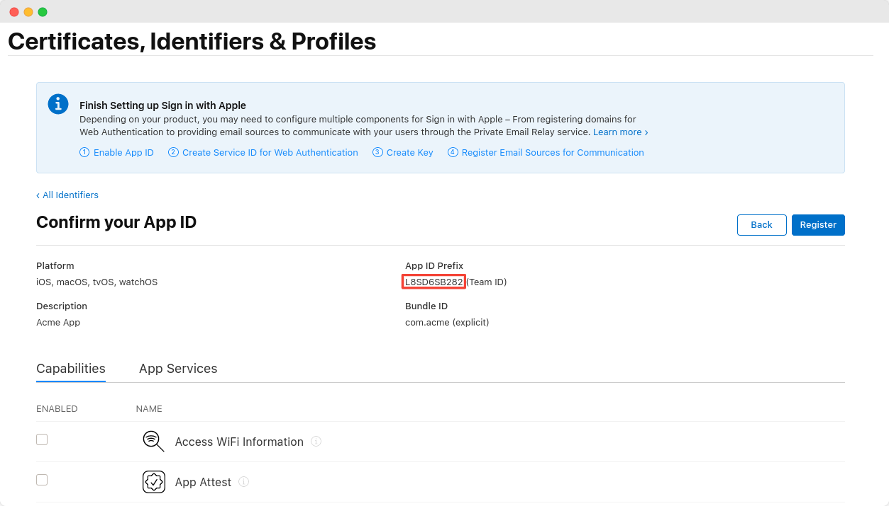
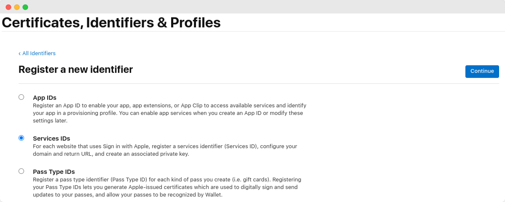
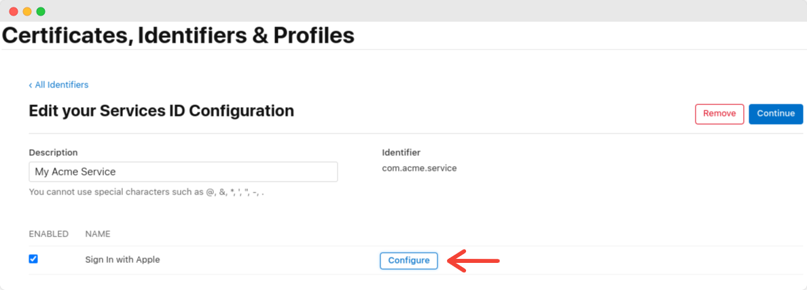
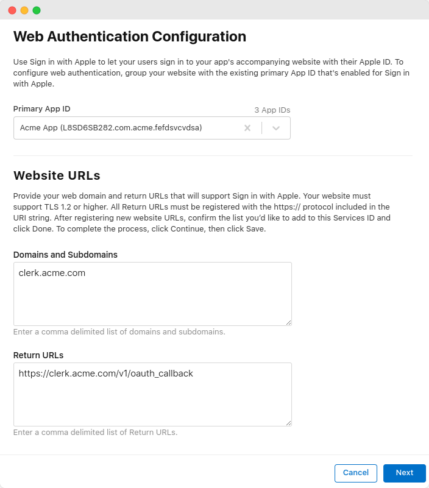
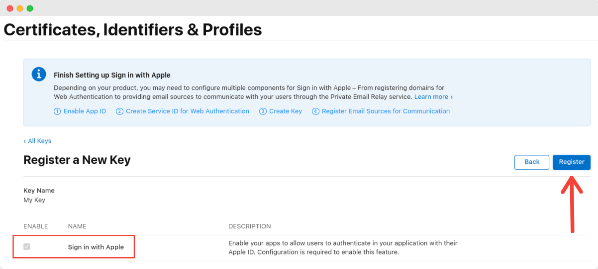
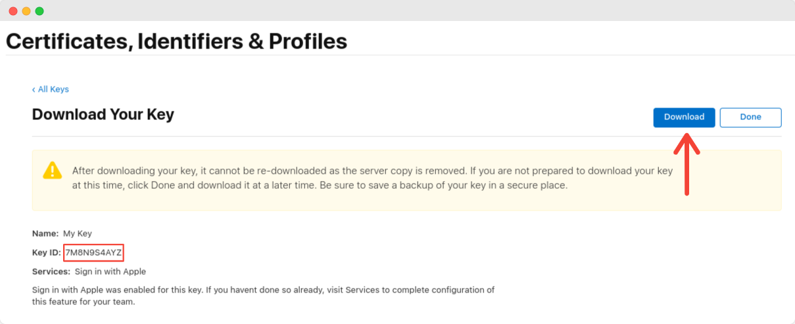
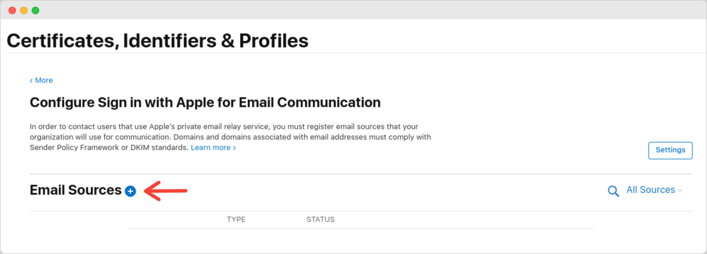
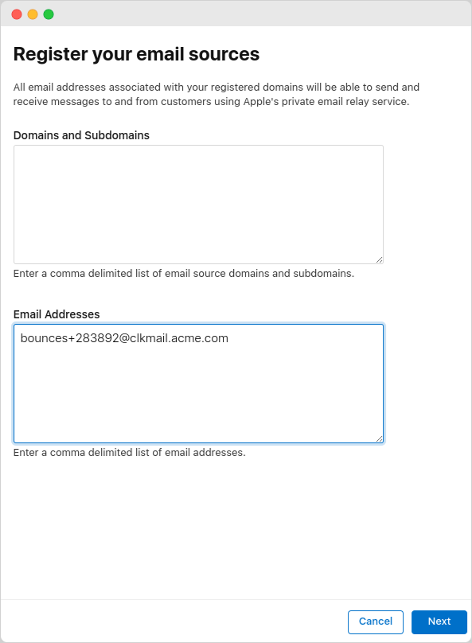
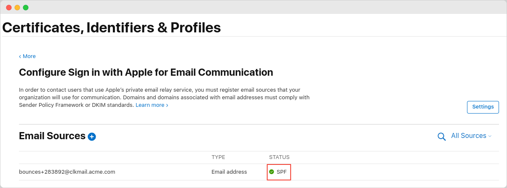
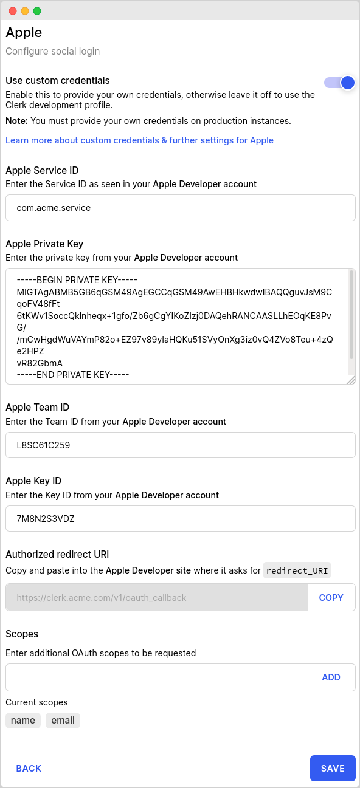

# Apple

## Overview

In this guide, we'll see how we can add **Sign In with Apple** to your Clerk instance.

To make development flow as smooth as possible, Clerk uses pre-configured configuration profiles - steps are needed to your part (other than enabling the provider from Dashboard).&#x20;

For production instances, the process for Apple is a bit more complicated compared to other providers, but don't worry - we're going to guide you  through it step-by-step.


The purpose of this guide is to help you create an Apple App that can be used with Clerk's OAuth implementation, for the purpose of integrating your application with [Sign in with Apple](https://developer.apple.com/sign-in-with-apple/). If you're looking for step-by-step instructions using Clerk to add social login (OAuth) to your application, follow the [Social login (OAuth)](../../popular-guides/social-login-oauth.md) guide.


## Before you start

* You need to create a Clerk Application in your [Clerk Dashboard](https://dashboard.clerk.dev). For more information, check out our [Setup your application](../../popular-guides/setup-your-application.md) guide.
* You need to have an Apple Developer account. To create one, visit the [Apple Developer portal](https://developer.apple.com).

## Configuring Apple social login

To configure Apple SSO in your Clerk instance, we'll need to retrieve (4) configuration values from the Apple Developer portal and enter them into your instance settings in Clerk Dashboard:

* the Apple Team ID
* the Apple Services ID
* the Apple Key ID
* the generated private key

Also, we'll need to retrieve (2) configuration values from Clerk Dashborad and enter them into the Apple Developer portal:

* the return URL (aka. OAuth redirect URI)
* the Email Source for Apple's Private Email Relay service

In the next sections of this guide, we'll see how we can get each of these. Let's get to it!

First, sign in to the Apple Developer portal and from the sidebar click on **Certificates, Identifiers and Profiles.**

.png>)

### Retrieving the Apple Team ID

The first thing we have to do is create an **App ID**. You can think of it like a top-level container that logically groups all of the resources we'll have to create for your application (keypairs, services etc.)

From the sidebar on the left, click on **Identifiers** and make sure that from the dropdown at the top-right corner, the **App IDs** option is selected. Then, click on the blue plus icon.

You'll be taken to a **Register a new identifier** page with several choices. Select the **App IDs** option and click **Continue.**

On the next page, you'll be prompted to select a **type** for your application. Choose **App** and click **Continue.**

In the next screen, you'll have to fill in a description for your App ID and a Bundle ID. None of these matter for the purposes of this guide, but it's good to pick something descriptive.

Also, from the list of Capabilities displayed right below, make sure that **Sign In with Apple** is checked. Then click **Continue** and in the confirmation screen.

From the confirmation screen, write down the value displayed in the **App ID Prefix** - this is the **Team ID** that we'll use later on when configuring your Clerk instance.

Finally, click **Register** to complete the creation of your App ID.

### Retrieving the Apple Services ID

Now that we have created an App ID, we can create a Services ID.

Navigate back to the **Certificates, Identifiers & Profiles** screen and from the sidebar, click on **Identifiers**.

On the next screen, select **Services ID** from the dropdown at the top-right corner and click on the blue plus icon to create a new Services ID.

.png>)

You'll be taken to the same **Register new identifier** screen as in the previous section. This time, we'll choose **Services IDs** from the various options we're presented and then click **Continue**.

In the next screen, fill in a description and an **Identifier**. This identifier is important, since it is our **Services ID** value we'll need later on to configure our instance, so make sure to note it down.

After the registration is finished, go back to configure the newly-created Services ID. Make sure the **Sign In with Apple** box is enabled and click **Configure**.

This configuration screen is where you tell Apple what domain and redirect URIs your application will use. Choose the App ID we created before, and in the domain enter `clerk.<your-domain>`.

Next, go to Clerk's [Dashboard](https://dashboard.clerk.dev), select your application **** and instance and go to **Authentication -> Social Login**. Click the gear **** icon next to the Apple provider and copy the **Authorized redirect URI** value. Paste the value into the **Return URLs** in Apple Developer Portal and click **Next**.

### Retrieving the Apple Key ID and private key

Apple differs a bit from most other providers, in that it does not use a shared Client Secret, but rather public/private keypairs.

The general concept is that a keypair is generated in the Apple Developer portal, and during an OAuth flow, your application is expected to mint a JWT that's signed with that private key. The private key essentially replaces the commonly used "Client Secret" that we see in other OAuth vendors.

Let's see how to generate a keypair and how to retrieve the Key ID and the private key values that we'll need to configure Apple SSO in Clerk.

Once again, navigate to the **Certificates, Identifiers & Profiles** page and choose **Keys** from the sidebar. In the next screen, click the blue plus icon.

Fill in a descriptive name (it doesn't matter much) and make sure you've ticked the **Sign In with Apple** checkbox from the list below. Then, click the corresponding **Configure** on the right column.

You'll be taken to a page where you'll have to associate the key you're about to create, with an **App ID**.

From the **Primary App ID** dropdown, select the App ID we created in the first step of this guide and click **Save**.

You'll be taken back to the previous **Register a New Key** page. Click **Continue** and you'll be presented with the final confirmation screen. Verify that **Sign in with Apple** is checked and click **Register**.

You'll be taken in a page titled **Download Your Key**. From here, we want to note down the displayed **Key ID**. **** We will also download the private key as a file (as the instructions point out, be sure to backup the key in a secure place). Click on **Download** to retrieve the private key.

With the Key ID and our private key at hand, we have everything we need to configure Apple SSO in your Clerk Dashboard. Click **Done**.

### Configuring Email Source for Apple Private Relay users


This section concerns only production instances. Development and staging instances are handled for you automatically.


Apple provides a privacy feature called [Hide My Email](https://support.apple.com/en-us/HT210425#hideemail), in which users can choose to Sign In with Apple to your instance, but without revealing their real email addresses. Instead, your instance will receive an app-specific email address, that will nevertheless forward any emails to the real user's address.

To be able to send email properly to users with private addresses, you must o configure an additional setting in the Apple Developer portal.

First, navigate to Clerk Dashboard, to your _production_ instance's **Social Login** settings page. Click to enable Apple, and in the configuration modal you'll see a read-only setting named **Email Source for Apple Private Email Relay**.


This setting is only available after you have deployed your instance.


The value of the setting is essentially an email address; copy it and go to Apple Developer portal, and specifically to the **Certificates, Identifiers & Profiles** page. Click on **More** from the sidebar on the left and then **Configure**.

On the next screen, click on the blue plus icon to add a new **Email Source**.

Paste the value you copied from the Clerk Dashboard to the **Email Addresses** field and click **Next.** Then click **Register** to confirm the changes.

After this, you should now see the email address added to the list, and it should be marked as verified with a green check icon.

If it does not appear as Verified yet, don't worry, DNS propagation may take some time to complete. Wait a few minutes (it could even be hours) and click on **Reverify SPF** button from that list.

For more info about Apple's Private Relay service, refer to the following documentation:

* [https://support.apple.com/en-us/HT210425#hideemail](https://support.apple.com/en-us/HT210425#hideemail)
* [https://help.apple.com/developer-account/?lang=en#/devf822fb8fc](https://help.apple.com/developer-account/?lang=en#/devf822fb8fc)

### Configuring the settings in your instance

If you completed the previous steps of this guide, by now you should have the following information available, all provided by the Apple Developer portal:

* the Apple Team ID
* the Apple Services ID
* the Apple Key ID
* the private key file

Don't worry, the hard part is over. Now you can go to your instance's settings in the Dashboard, and navigate to the **Social Login** settings under **User & Authentication**. Find the **Apple** provider from the list, toggle it on and click on the gear icon.

In the modal, you'll see all the corresponding fields that you should paste the aforementioned values into. For the private key file, open it with a text editor and just copy/paste the contents.&#x20;

After filling in the settings, you'll end up with something roughly like this:

Click **Save** and you should be good to go - you can now navigate to your application and sign in with Apple!

### References

* [Official Sign In with Apple documentation](https://developer.apple.com/documentation/sign\_in\_with\_apple)
* [Social Login (OAuth) with Clerk](../../popular-guides/social-login-oauth.md)
