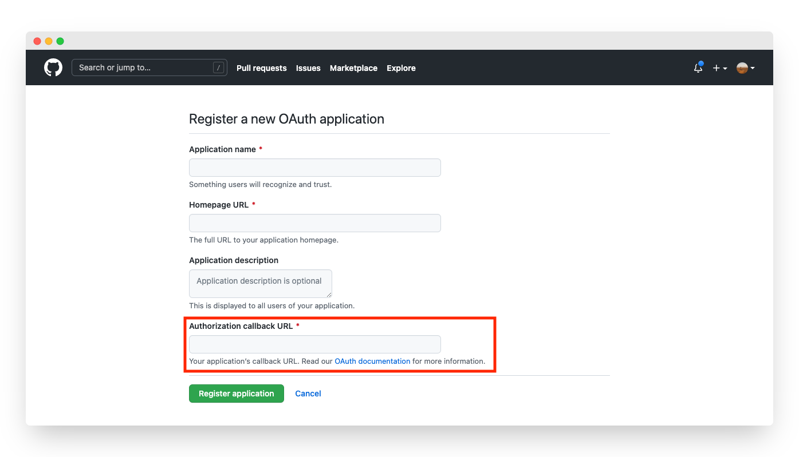
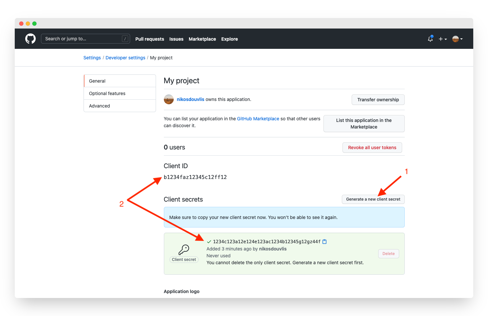

# Github

## Overview

Adding social login with Github to your app with Clerk is simple -  you only need to set the **Client ID**, **Client Secret** and **Authorized redirect URI** in your instance settings.

To make the development flow as smooth as possible, Clerk uses preconfigured shared OAuth credentials and redirect URIs for development instances - no other configuration is needed.&#x20;

For production instances, you will need to generate your own Client ID and Client secret using your Github account.


The purpose of this guide is to help you create a Github account and a Github OAuth app - if you're looking for step-by-step instructions using Clerk to add social login (OAuth) to your application, follow the [Social login (OAuth)](../../popular-guides/social-login-oauth.md) guide.


## Before you start

* You need to create a Clerk Application in your [Clerk Dashboard](https://dashboard.clerk.dev). For more information, check out our [Setup your application](../../popular-guides/setup-your-application.md) guide.
* You need to have a Github account. To create one, [click here](https://github.com/signup) .

## Configuring Github social login

First, you need to register a new OAuth Github app. Follow the official Github instructions on [how to create an OAuth app](https://docs.github.com/en/developers/apps/building-oauth-apps/creating-an-oauth-app).

Notice that you need to add the **Authorization callback URL**. Go to the [Clerk Dashboard](https://dashboard.clerk.dev), select your **Application**, **** and navigate to **Instances** ➜  **Settings** **** ➜  **User Management** ➜ **SSO**.  Click the **Manage credentials** button under the Github provider, select **Custom profile** and copy the **Authorized redirect URI**. Go back to the Github panel, paste the value into the **Authorization callback URL** field and compete the registration.

Once registration is complete, you'll get redirected to project's admin panel. Click the **Generate a new client secret** button to get your new client secret. Then, copy the **Client ID** and **Client secret.** Go back to the Clerk Dashboard and paste them into the respective fields.

Don't forget to click **Apply** in the Clerk dashboard. Social login with Github is now configured 🔥&#x20;

## Next Steps

Learn how to add social login with Github to your Clerk application by following the [Social login (OAuth)](../../popular-guides/social-login-oauth.md) guide.
