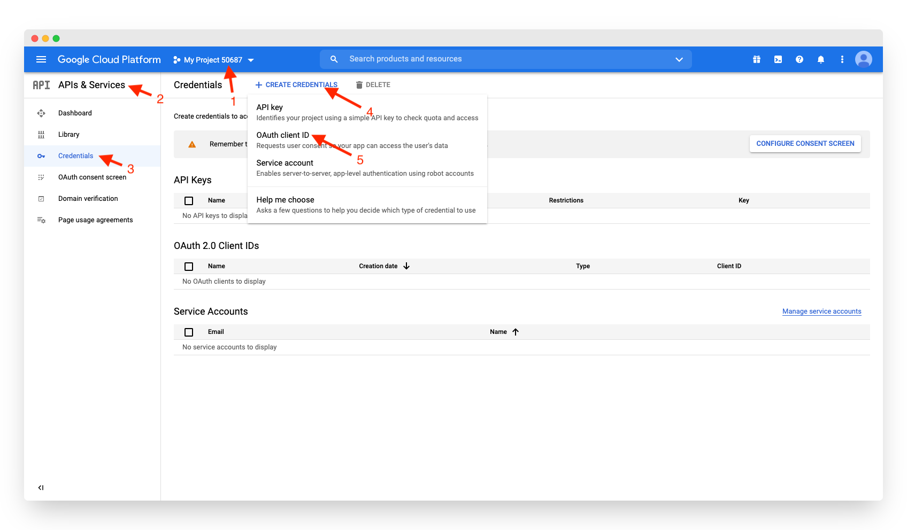

# Google

## Overview

Adding social login with Google to your app with Clerk is simple -  you only need to set the **Client ID**, **Client Secret** and **Authorized redirect URI** in your instance settings.

To make the development flow as smooth as possible, Clerk uses preconfigured shared OAuth credentials and redirect URIs for development instances - no other configuration is needed. 

For production instances, you will need to create your own developer account with **Google** and generate your own Client ID and Client secret.


The purpose of this guide is to help you setup a Google developer account and a Google OAuth2.0 project - if you're looking for step-by-step instructions using Clerk to add social login \(OAuth\) to your application, follow the [Social login \(OAuth\)](../../popular-guides/social-login-oauth.md) guide.


## Before you start

* You need to create a Clerk Application in your [Clerk Dashboard](https://dashboard.clerk.dev). For more information, check out our [Setup your application](../../popular-guides/setup-your-application.md) guide.
* You need to have a Google Developer account. To create one, visit the [Google Cloud console](https://console.developers.google.com/).

## Configuring Google social login

First, you need to create a new Google project and enable OAuth2.0 support. Follow the official Google instructions on [how to setup up an OAuth 2.0 application](https://support.google.com/cloud/answer/6158849?hl=en).

Once you have a OAuth client ID ****created, click on the newly created ID under **OAuth 2.0 Client IDs** and copy the Client Id and Client Secret. 

Go to the [Clerk Dashboard](https://dashboard.clerk.dev), select your **Application**, ****and navigate to **Instances**  ➜  **Settings**  ****➜  **User Management** ➜ **SSO**.  Click the **Manage credentials** button under the Google provider, select **Custom profile** and paste the values you obtained during the previous step.

Before you close the **Manage credentials** modal, copy the **Authorized redirect URI.** Add it to the Google console dashboard by creating a new **Authorized redirect URI** as shown in the screenshot above. 

Don't forget to click **Apply** in the Clerk dashboard. Social login with Google is now configured 🔥 

## Next Steps

* Learn how to add social login with Google to your Clerk application by following the [Social login \(OAuth\)](../../popular-guides/social-login-oauth.md) guide.

